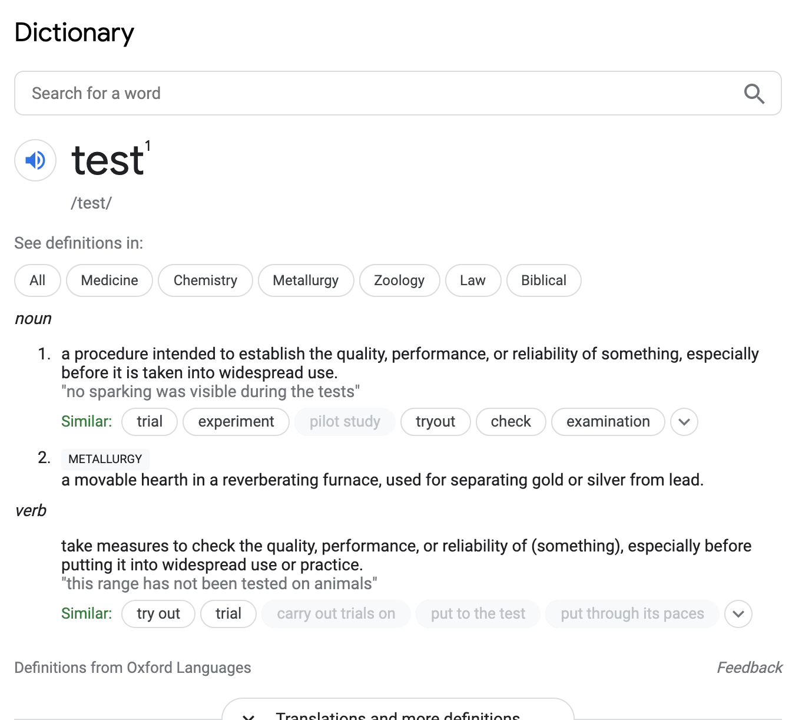
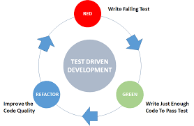

# Unit Testing

[Unit Testing Mindmap](/unit_testing_mindmap.md)

### [Introduction](#introduction)
### [Benefits](#benefits)
### [Test Driven Process](#process)
### [Unit Test Phases](#phases)
### [Unit Testing - DOs & DON'Ts](#dos)
### [Test Driven Development](#tdd)
### [Mock](#mocks)

### Indroduction <a class="introduction"></a>


Test is used to take measure to check the quality, performance, and reliability of practice.

- Test behaviors, not methods
- Test should cleanup after themselves
- Recreate defects with a test before fixing defects
- Atomic - test should have a single purposr
- Repeatable
- Include boundary and null tests

#### Acceptance Tests
- Functional (UI)
- Integration
- Unit

### Why do we want unit tests? <a class="benefits"></a>
Unit tests are used to verify the code quality, performance and maintainability.
- Improves low-level software quality
- Reduce cost and improves efficiency
    - early bug detection = easier fix
    - miminize over/under design/coding
- Feedback improves design/coding
- Measures development progress
- Drives Test Driven Development
- Becomes documentation
- Reduce cost of change
- Necessary for refactoring
- Provides confidence

### Test Driven Process <a class="process"></a>


Test driven process includes:
- Write a test which should fail
- Refactor to write the implementation
- Run the test and make it pass
- Refactor
- And run the coverage

Test driven process is often described as **Red-Green-Refactor**. Basically, start writing a test, which should fail. The test fails because you do not have the implementation or the implementation. That take us to write the implementation. Think this as if, if you do not have a class to test, then what are you testing against. Writing test before implementing certain functionality is refered to as test driven development.

In test driven development you write the test first.

### Unit Test Phases <a class="phases"></a>
- Setup - setting up data (`setup` and test methods)
- Exercise - object under test is executed
- Verify - assertions are done to validate results
- Teardown - cleanup us performed (`tearDown` method)
    - **A**rrange
    - **A**ct
    - **A**ssert
### DOs and DONTs <a class="dos"></a>
#### DOs
- Separate production code from test code
    - use same package name but different source
- Test behavior, not methods
    - test should describe the behavior of the test rather than how it is implemented
- Recreate details with a test before fixing defects
- Test should clean up after themeselves
    - test should not cause any side effects
    - use `setUp` and `tearDown`
- Must be treated as "First Class Code"
    - test should "be simple, have a few parts, and be easy to maintain"
- Atomic - tests should have single purpose
- Express intent
    - include a descriptive doc before each test method
    - include a message that describes the business rule or purpose
- Repeatable - test will run repeatedly and frequently
- Name test class `<class_name>_test.dart` (or `<ClassName>Test.java` in case of Java)
- Include boundary and null value tests
- Strive for 80% or greater code coverage

#### DONTs
- Don't test constants
- Don't test construction
- Make tests dependent on the file system resources
- Increase methode visibility just for testing
    - don't make things public just for testing, perfer package-visibility
- Catch exceptions
    - let exceptions bubble up
- Make behavior test dependent on date
- Initialize tests in test class constructor
- Write to `System.out` or `print`, assert it

### Test Driven Process <a class="tdd"></a>
- Start with assert
- Define inputs
- Define interface
- Run tests (fail)
- Write simple implementation to make tests pass
- Run tests (pass)
- Refactor to make code readable and maintainable
- Review code coverage

### Mock <a class="mocks"></a>
 A mock is a class that replicates another class. A mock allows "mocking" of the methods of the replicated class

 #### Mocking a class
 In order to support assertion and verification, you need to mock a class.

 ```
 class Example {
        // Some functions
 }
 ```

 Extending mock:
  `class MockExample extends Mock implements Example {}`

  Create Mocked Object
  `var mockExample = MockExample()`

### Resources
- [Mockito](https://pub.dev/packages/mockito)
- [Mock dependencies using Mockito](https://flutter.dev/docs/cookbook/testing/unit/mocking)
